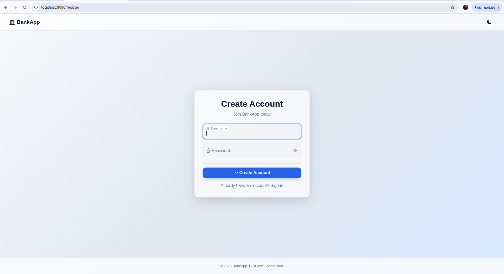
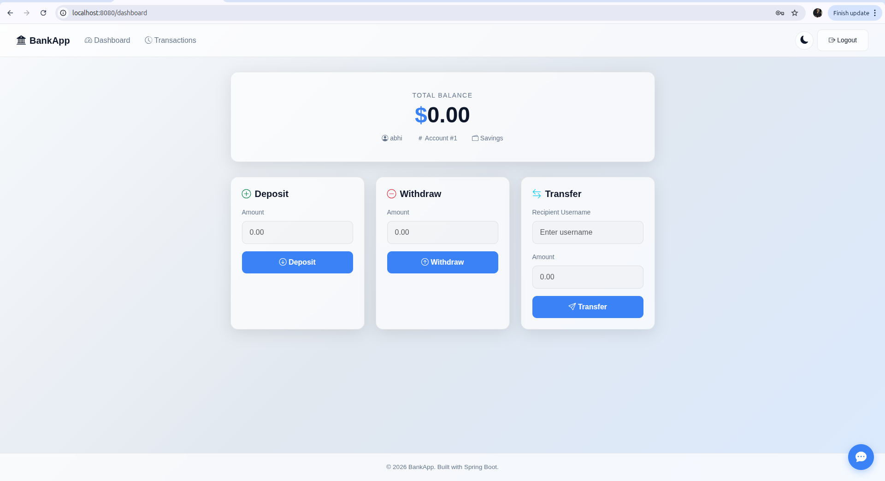
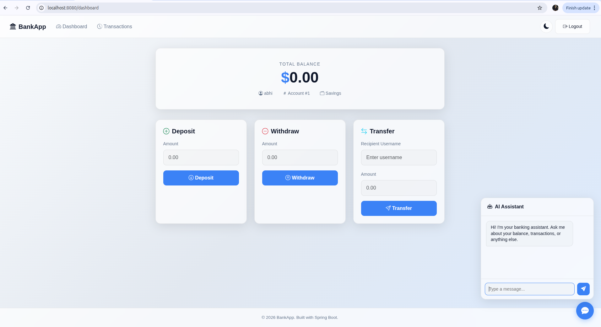
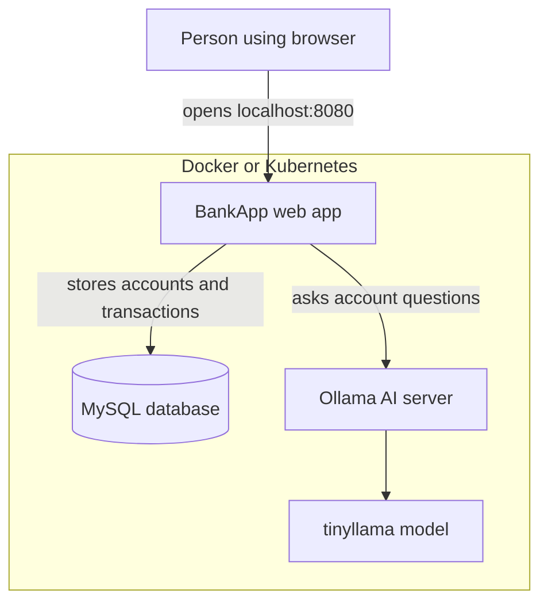

# BankApp

BankApp is a simple banking web application. You can create an account, log in, deposit money, withdraw money, transfer money, view transactions, and ask the built-in AI assistant questions about your account.

The AI assistant runs with **Ollama** and the **tinyllama** model. It is local to your machine or Kubernetes cluster, so you do not need an OpenAI key or any cloud AI account to try the app.

## What You Will See

### Create Account



### Dashboard



### AI Assistant



## How The App Works



## Easiest Way: Run With Docker

Use this if you just want the app running on your laptop.

### 1. Install Required Apps

Install these first:

- Docker Desktop or Docker Engine
- Git

Check Docker is working:

```bash
docker --version
docker compose version
```

### 2. Start The App

Open a terminal in this project folder and run:

```bash
docker compose up -d
```

This starts three containers:

- `bankapp` - the website
- `bankapp-mysql` - the database
- `ollama` - the local AI server

### 3. Download The AI Model

Run this once after the containers start:

```bash
docker compose exec ollama ollama pull tinyllama
```

This may take a few minutes the first time.

### 4. Open The App

Open this in your browser:

```text
http://localhost:8080/register
```

Create a new account, then log in. After login you can use:

- Dashboard: `http://localhost:8080/dashboard`
- Transactions: `http://localhost:8080/transactions`
- AI assistant: chat button on the dashboard

### 5. Stop The App

```bash
docker compose down
```

To remove saved database and AI data also:

```bash
docker compose down -v
```

## Run With Kubernetes

Use this if you want to run the app like a small production system.

### 1. Install Required Apps

Install these first:

- Docker Desktop or Docker Engine
- kubectl
- kind

Check they are installed:

```bash
docker --version
kubectl version --client
kind version
```

### 2. Create A Local Kubernetes Cluster

```bash
kind create cluster --config setup-k8s/kind-config.yml
```

### 3. Deploy BankApp, MySQL, And Ollama

```bash
kubectl apply -f k8s/namespace.yml
kubectl apply -f k8s/persistancevolume.yml
kubectl apply -f k8s/secret.yml
kubectl apply -f k8s/configmap.yml
kubectl apply -f k8s/pvc.yml
kubectl apply -f k8s/ollama-pvc.yml
kubectl apply -f k8s/mysql-deployment.yml
kubectl apply -f k8s/ollama-deployment.yml
kubectl apply -f k8s/service.yml
kubectl apply -f k8s/ollama-service.yml
kubectl apply -f k8s/bankapp-deployment.yml
```

Optional autoscaling:

```bash
kubectl apply -f k8s/horizontal_pod_autoscaler.yml
```

### 4. Wait Until Everything Is Ready

```bash
kubectl get pods -n bankapp
```

Wait until the pods show `Running`. Ollama can take extra time because it downloads the `tinyllama` model inside the cluster.

### 5. Open The App

Open this in your browser:

```text
http://localhost:8080/register
```

The Kind config maps your laptop port `8080` to the Kubernetes BankApp service.

### 6. Delete The Kubernetes Setup

```bash
kind delete cluster --name tws-cluster
```

## Run Without Docker

This is mainly for developers.

You need:

- Java 21
- MySQL 8
- Ollama
- tinyllama model

Start MySQL and Ollama first, then run:

```bash
ollama pull tinyllama
./mvnw spring-boot:run
```

Then open:

```text
http://localhost:8080/register
```

## Important Settings

The app reads these settings from environment variables:

| Setting | What it means | Default value |
| --- | --- | --- |
| `MYSQL_HOST` | MySQL server name | `localhost` |
| `MYSQL_PORT` | MySQL port | `3306` |
| `MYSQL_DATABASE` | Database name | `bankappdb` |
| `MYSQL_USER` | Database user | `root` |
| `MYSQL_PASSWORD` | Database password | `Test@123` |
| `OLLAMA_URL` | Ollama server URL | `http://localhost:11434` |

For Docker, these are already set in `docker-compose.yml`.

For Kubernetes, these are set in:

- `k8s/configmap.yml`
- `k8s/secret.yml`

## Useful Commands

See Docker containers:

```bash
docker compose ps
```

See app logs:

```bash
docker compose logs -f bankapp
```

See Ollama models:

```bash
docker compose exec ollama ollama list
```

See Kubernetes pods:

```bash
kubectl get pods -n bankapp
```

See Kubernetes app logs:

```bash
kubectl logs -n bankapp deployment/bankapp-deployment
```

## Common Problems

### The website does not open

Make sure the app is running:

```bash
docker compose ps
```

Then open:

```text
http://localhost:8080/register
```

### The AI assistant says it is unavailable

Make sure Ollama is running and the model exists:

```bash
docker compose exec ollama ollama list
```

If `tinyllama` is missing, run:

```bash
docker compose exec ollama ollama pull tinyllama
```

### Port 8080 is already used

Another app is already using port `8080`. Stop that app, or change the left side of this line in `docker-compose.yml`:

```yaml
ports:
  - "8080:8080"
```

For example, use `8081:8080`, then open `http://localhost:8081/register`.

## Project Files

| File or folder | Purpose |
| --- | --- |
| `src/main/java` | Java source code |
| `src/main/resources/templates` | Web pages |
| `src/main/resources/static` | CSS, JavaScript, and static files |
| `Dockerfile` | Builds the BankApp container |
| `docker-compose.yml` | Starts BankApp, MySQL, and Ollama with Docker |
| `k8s/` | Kubernetes setup files |
| `setup-k8s/kind-config.yml` | Local Kind cluster setup |
| `scripts/ollama-setup.sh` | Ollama setup script for a server |

